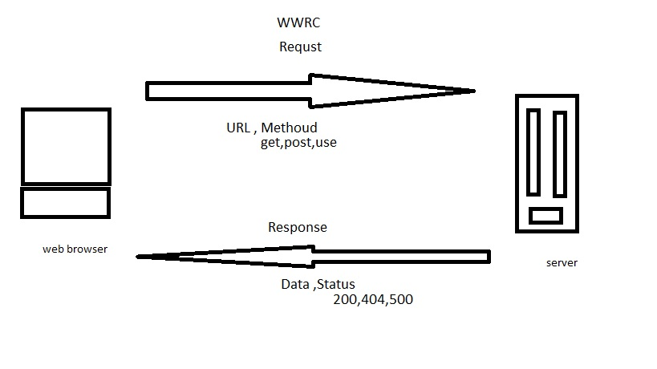

# Movies-Library

## Firas Awadallah

step to build Server:

1. sure node exists on his machine  "node--version".

2. install "npm init -y ".

3. create index.js file .

4. install express package  "npm install express"  

5. run the server using node index.js

## application structure

node moudules

.gitignore

data.json

index.js

LICENSE

package-lock.json

package.json

README.md
