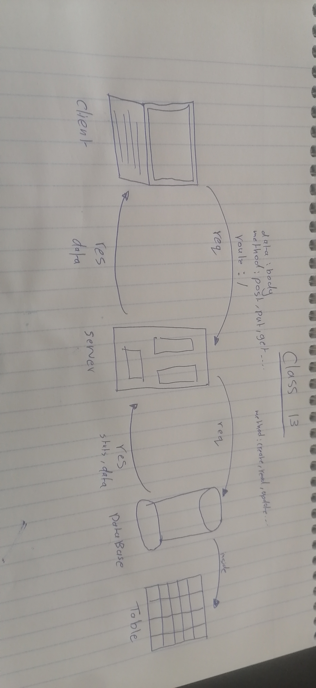

# Movies-Library

## Firas Awadallah

step to build Server:

1. sure node exists on his machine  "node--version".

2. install "npm init -y ".

3. create index.js file .

4. install express package  "npm install express"  

5. run the server using node index.js

### lab12

1. Create GET request 3rd party API 
2. Create routes /trending and /search
3. add 2 more routes /certification and /discover
4. install axios and dotenv and nodemon

### lab13

1. Create database "movies" and table "movies"  and install pg

2. create a post request to save a specific movie to database
3. Create a get request to get all the data from the database